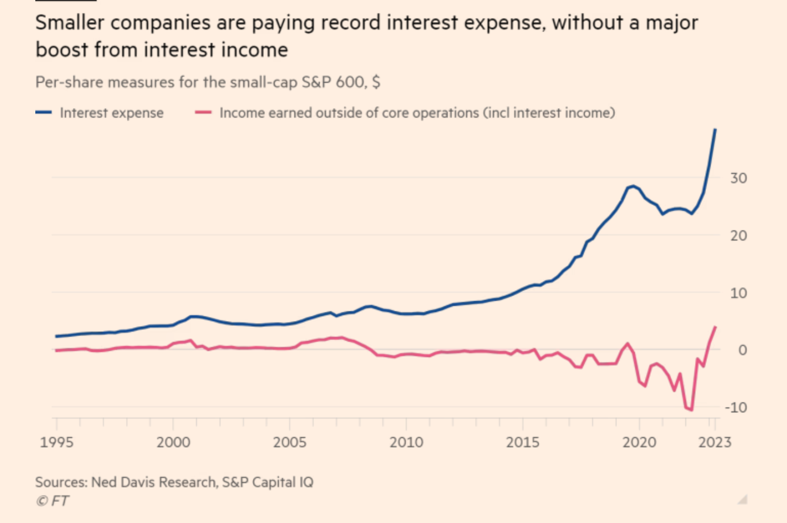

*Cautionary Advised : 
The following is opinion and not advice. Consult your financial advisor, click on [Terms](/terms) for more.*

2024 presents a pivotal moment for the US economy as the FED continues to navigate a soft-landing, coinciding with an election year.

### Current status of the US economy.
- Strong to full employment.
- Q1 2024 GDP better than estimates.
- YoY inflation has fallen and is currently in the ballpark of 3% compared to 9% a year before.
- [Consumer spending surging YoY](https://twitter.com/SethCL/status/1776216429693411371)
- Uplift in total factor productivity with the help of Gen-AI.
- Mergers & Acquisition activity ticking back up after a whole year of inactivity. 
- CEOs emphasis on operational efficency improvements, preparing for a US recession, which in the end did not happen. (Shown in the diagram below)


While it may appear that the economy is much more resilient than many people have projected, and a higher for longer environment is warranted. It's important to look at the broader context and not only the S&P 500.

The pace of the recent rate hike was the steepest in centuries, and the pressure exerted has a lagged effect. The effect ? Small caps which often have weak balance sheets being pushed to unprofitability and eventual defaults. The supply of loans to the leveraged loan markets (loan-market to high-debt companies with lower credit ratings) have been severely disrupted. Its repercussions wouldn't be apparent for the investors focusing only on the top 100 performing companies. Here's an excerpt from an [article from Axios on the current state of the leveraged loan markets](https://www.axios.com/2024/04/04/credit-markets-leveraged-loans?utm_campaign=editorial&utm_source=twitter&utm_medium=social)


US Regional banks, US housing, everything that is interest rate sensitive are in summary going to be fucked if the rate cuts aren't proactively done by the FED. If they are instead reactive we will have to see things break.

Below are a few points on why a FED pivot (rate cut) is imminent to navigate a soft landing : 
## Why rate cuts are necessary : 

### Bank of Japan's First Rate Hike in 17 years:
The Bank of Japan raised interest rates for the first time in 17 years. Japan, having an accommodative monetary policy, kept interest rates at zero, with periods of negativity. Previously, Japan acted as the backstop for global liquidity while the US and EU tightened policies to combat inflation. However, roles will soon reverse as Japanese consumer prices have inflated, pressuring the BOJ to begin its first rate hike in 17 years. This change means there will no longer be an unlimited supply of yen to buy government bonds, Japanese or otherwise. US 10-year Treasury Yields have been creeping upwards ! 

### US Small Cap wilting in high interest rate environments
A diagram extracted from the Financial Times shows that small caps have to service record interest expense. Many small caps are having a tough time as they have less resilience balance sheets e.g. higher debt/equity ratios. [Small-Cap S&P 600 covers companeis with market cap of 1 to 6.7 billion](https://en.wikipedia.org/wiki/S%26P_600)  



### Election Year : 
Although the Federal Reserve should operate independently from political influence, Jereme Powell is indirectly incentivized to hyperinflate the economy and keep markets rallying to declare economic success for the current administration.


### US Treasury struggles to service debt
The US would struggle to service debt holding rates at 5.25%. Issuing bonds to finance existing interest and principal payments becomes costly. Eventually, economic activity will be hampered by the lagged effect of the steepest rate hiking cycle in history. 
Debt-to-GDP Ratio will increase over time, leading the US into a further debt spiral.


The solution to this ? Rate cuts. 

Cut rates to spur economic activity and allow GDP to outpace the growth of debt. This expansion would enlarge the tax base and government revenue, which could be used to pay down debt.


All in all, my base case would be the FED would initiate its first cut during the FOMC meeting in June 2024.

As of April 5th, there will be three CPI and PCE reports in April, May, and June to bolster the "data-dependent" Fed's decision to pursue further cuts. Algorithms will continue to trade based on FOMC members' statements, each expressing differing opinions. However, as an investor, you simply need to sit tight through the volatility.
```