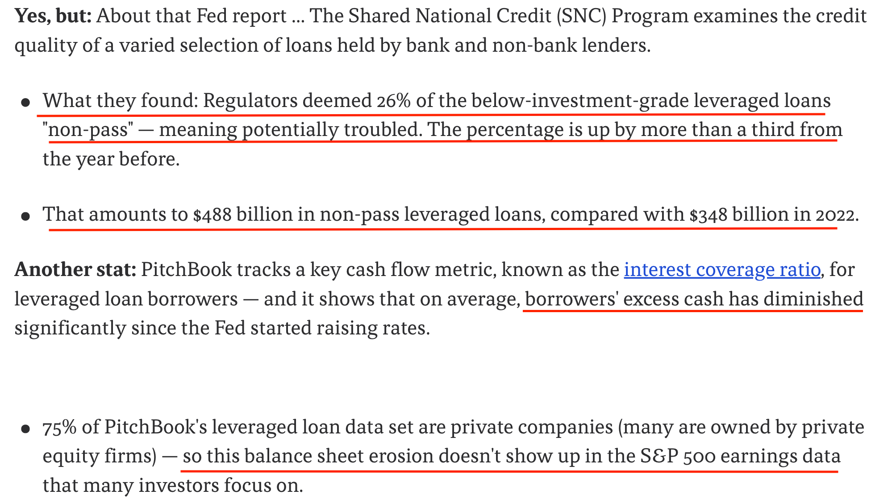

*Cautionary Advised : 
The following is opinion and not advice. Your investment objective, risk-tolerance and timeframe might be different from mine so do consult your financial advisor, click on [Terms](/terms) for more.*


The year 2024 presents a pivotal moment for the US economy as the FED continues to navigate a soft-landing in an election year.

### The US currently has a perfect Goldilocks Economy
- Strong to full employment.
- Economic expansion.
- YoY inflation has fallen and is currently in the ballpark of 3% compared to 9% a year before.
- Huge operational efficency improvements as CEOs were preparing for a US recession, which in the end did not happen. (Shown in the diagram below)


While it may appear that the economy is much more resilient then many people have projected,it's important to focus on the broader context.

The pace of the recent rate hike was the steepest in centuries, and the pressure exerted would have a lagged effect. This would severely impact the supply of loans to the leveraged loan markets (high-debt companies with lower credit ratings), which its repercussions wouldn't be apparent if investors were focusing on the S&P 500 index. Here's an excerpt from an [article from Axios on the current state of leveraged loan markets](https://www.axios.com/2024/04/04/credit-markets-leveraged-loans?utm_campaign=editorial&utm_source=twitter&utm_medium=social)



Below are a few points on why a FED pivot (rate cut) is imminent to navigate a soft landing : 
## Why rate cuts are necessary : 

### Bank of Japan's First Rate Hike in 17 years:
The Bank of Japan raised interest rates for the first time in 17 years. Japan, having an accommodative monetary policy, kept interest rates at zero, with periods of negativity. Previously, Japan acted as the backstop for global liquidity while the US and EU tightened policies to combat inflation. However, roles will soon reverse as Japanese consumer prices have inflated, pressuring the BOJ to begin its first rate hike in 17 years. This change means there will no longer be an unlimited supply of yen to buy government bonds, Japanese or otherwise. US 10-year Treasury Yields have been creeping upwards ! 

### US Small Cap wilting in high interest rate environments
A diagram extracted from the Financial Times shows that small caps have to service record interest expense. Many small caps are having a tough time as they have less resilience balance sheets e.g. higher debt/equity ratios. 


### Election Year : 
Although the Federal Reserve should operate independently from political influence, Jereme Powell has an incentive to hyperinflate the economy and keep markets rallying to declare economic success for the current administration.


### US Treasury struggles to service debt
The US would struggle to service debt holding rates at 5.25%. Issuing bonds to finance existing interest and principal payments becomes costly. Eventually, economic activity will be hampered by the lagged effect of the steepest rate hiking cycle in history. 
Debt-to-GDP Ratio will increase over time, leading the US into a further debt spiral.


The solution to this ? Rate cuts. 

Cut rates to spur economic activity and allow GDP to outpace the growth of debt. This expansion would enlarge the tax base and government revenue, which could be used to pay down debt.


All in all, my base case would be the FED would initiate its first cut during the FOMC meeting in June 2024.

As of April 5th, there will be three CPI and PCE reports in April, May, and June to bolster the "data-dependent" Fed's decision to pursue further cuts. Algorithms will continue to trade based on FOMC members' statements, each expressing differing opinions. However, as an investor, you simply need to sit tight through the volatility.
```