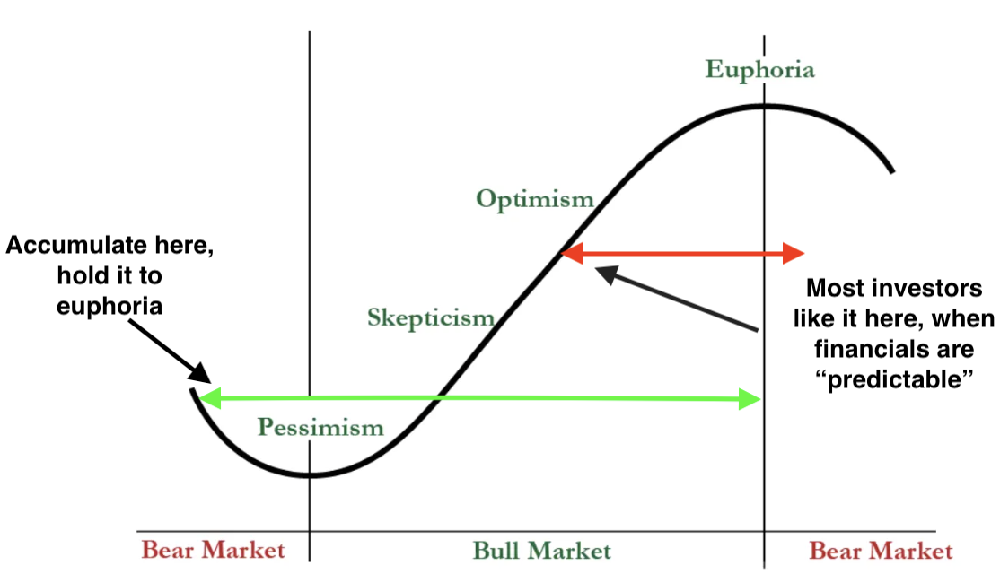

*Cautionary Advised : 
The following is opinion and not advice. Your investment objective, risk-tolerance and timeframe might be different from mine so do consult your financial advisor, click on [Terms](/terms) for more.*

### Preface
While the notion of an "Investing Machine" capable of predicting market movements and generating extraordinary gains seems like something market strategists should strive for, the reality is that such a constantly self-calibrating system is virtually impossible.

_The need for overly complex mathematical models that are often fed noisy, unnormalized garbage data, that claims to have forecasting value, is often a bullshit sales tactic to impress prospective investors, defying Occam's razor principle of favoring simplicity_. Within this blogpost, i'll share with you a replicable investment framework.

### A replicable investment framework
For retail investors seeking a replicable, time-tested investment framework that could lead to outsized returns, the name of the game lies in a few fundamental principles:

1. Time Arbitrage and Bargain Hunting
2. Less Is More in Investing
3. Diversification, Position Sizing, and Leverage
4. Be an Investor, Not a Gambler

I will explore each of these elements within this article to develop a time-tested, retail-replicable investing framework that doesn't require you bueing glued to trading screens, constantly refreshing price feeds.

### Time Arbitrage and Bargain Hunting Is Your Edge
Just like how the house in your favorite casino 🎰 has an edge over you, **the retail investor actually has an edge over instutional investors when it comes to the stock market**. The key is that you have compete on a **longer time frame**. This powerful and often overlooked edge in investing is called **time arbitrage**. 

**Time arbitrage** simply means purchasing stocks that are sold based on a short-term outlook, with little change in the long-term prospects of the company. The edge for an investor with a long investing timeframe, simply comes from institutional investors consistently having short-term performance pressures, forcing them to hop around to the next 'hot' idea every 6-18 months. Fund managers have to benchmark their performance on an annually (somtimes quarterly) basis to attract client investment inflows, which is why they often aren't holding shares of companies that are still in the midst of finding their footing.

Another point is that, while the average retail investor is optimising your portfolio for maximal returns, the instituional investor are optimising a trade-off between Performance Fees and Management Fees(fees they charge for simply managing the money). 

This has several implications for the large institutional investors : 
1. They would rather see a steady growth of their Assets Under Management (AUM), as management fees are charged regardless of performance. This incentivizes them to prioritize asset gathering over maximizing returns, as their compensation is tied more closely to the former.
2. They would be more likely to give up volatility and uncertainty that comes with higher returns in exchange for steadier returns in the ball park of 5-12%. This is because their primary objective is to retain existing clients and attract new ones.(Having a -15% year and a subsequent 45% year, would likely lose you more AUM than if you had two years of steady 7% returns even though the former generates higher returns)
3. Because of 1. and 2., they would need to have strict risk limits inplace and hence can only hold small positions of stocks that have crashed in price despite having a huge turnaround opportunity.(since all measures of risk/volatility is based on historical price movements).

This all contributes to your edge as a long-term investor, empowering you to identify temporarily impaired companies (mispriced due to short-term outlook neglecting long-term potential), acquire them at bargain prices, and patiently hold until it fulfills the risk limits of institutional investors.

> "Skate to where the puck is going to be, not where it has been" - Waynze Gretzky

The great hockey player Wayne Gretzky provides a great hockey analogy to investing : **"You would want to skate to where the puck is going to be, not where it has been"**, and that means not chasing overcrowded picks like Nvidia at $1000 a share, but instead look for names under the surface that hasn't really budged.

The curve below illustrates when you should start building a position and accumulate shares. Institutional investors have strict mandates and run a career risk if they have huge drawdowns, hence why they tend to get in on stocks that have reached beyond the Skepticism phase.  **The bulk of the gains tend to happen during the move from deep pessimism to the return of optimism, and it tends to happen very quickly as well**. The long-term investor can then slowly ride it to euphoria -- the stage when valuation multiples expand to new highs, also the stage where you begin trimming positions

 Human nature and market structure allows the opportunistic long-term investor to scoop up shares of wonderful businesses/brands at a discounted price. Afterall, **Wall Street is the only place where everyone runs for the exist when there is a fire sale**.
So if you're an investor who has none of these restrictions, and can overtime build a position in investment ideas that are at peak pessimism but would eventually revitalize and show growth in 12-36 months from now, and hold them to euphoria, you will undoubtedly make outsize returns.

### Less Is More 
A counter-intuitive notion when it comes to investing is that **less is often more**. Inaction is often the best action when it comes to investing. The instincts that make one a successful entrepreneur can make them a poor investor -- there's no reward for constant action (buys and sells) when markets tend to act randomly in the short-term as you accumulate trading costs.

As Warren Buffett famously said, "Investing is not a game where the guy with the 160 IQ beats the guy with 130 IQ." It's not just intellect but also a emotional discipline and restraint that makes you a successful investor. **The intellectual work necessary to search for an investment opportunity and the exit price, happens before the allocation**. Beyond that, the remaining work is having the temperament to stick with your game plan. I'll talk more about the stock picking later.

### It all matters : Diversification, Sizing and Leverage
The only time-tested way to provide downside protection to your portfolio is not anticipating the next black-swan event ("financial argmageddon"), but through **true diversification**, achieved not merely by the number of investments but by the uncorrelated nature of those investments. 

For instance, a portfolio consisting of 100 altcoins would not be considered diversified, nor would a portfolio of 50 biotech companies racing to develop a cancer cure, or betting on 10 different New Electric Vehicle companies. In such cases, the thesis of your investment is driven by a single underlying factor, for altcoins, it would be lack of government trust or speculative cryptocurrency trends; for biotech companies, it would be the success or failure of a specific drug trial; and for EV companies, it would be new energy vehicle policies.  

The key is to always diversify across industries/countries if possible. **You however can't diversify away systematic risks that drive the overall market** , such as interest rates that dictate the cost of borrowing, overall consumer confidence, economic growth etc.

Sizing is important. Always size your positions correctly, by the risk-profile and implied move of a stock. If a stock has equal chance of doubling or folding in half, you would want to keep the allocation low, as it takes a 100% gain to recover from a 50% loss. Where as for established companies with great brand-power and economic moat like Coca-Cola, it could possibly be a 20% allocation without incurring huge unwarranted volatility to your portfolio, that the greater market would not experience.

Finally, as Munger famously said, there are three things that could ruin a person: "Liquor, Ladies, and Leverage." And hopefully, readers of this blog have the discipline to manager the first two vices as I would only elaborate on the third. You really should never take on leverage as you want to maximize resilience and time in the market. Leverage is a double-edged sword and would increase the chances of you getting wiped out as it would increase your chances of doubling your returns. 

This applies even to those who do not invest on margin or partake in leveraged option strategies. **If you have upcoming financial commitments and you're using that money to invest, you are effectively employing leverage**. This pressure often shifts your mindset from being an investor, to a degenerate gambler. Which brings me to my final point.

### Be an investor not a gambler

The true distinction between a gambler and an investor lies in two fundamental aspects. The first part of which I have addressed is having a poor risk-management strategy, placing your bets too concentrated in one or two factors that drive stock prices, instead of a healthy amount of 6-12 factors. You don't want to be the guy who bets his entire life savings on a single spin of the roulette wheel, do you? (Unless you're a high roller with money to burn, in which case, be my guest!)

The second trait that makes a gambler a gambler is **playing games that you have no edge**, meaning your odds of winning are nothing better than a coin-flip (<50% chance of winning). The reason why the house always wins is because they've calibrated their games to have a slight edge over you, and they have piles of cash to ruin you before you ever come close to ruining them. That's why casino regulars are called gamblers and never investors, and a successful gambler (in a casino) really just means they haven't gambled enough...yet. 

I say this because you could easily turn the stock market investments or your entrepreneurial business ventures into a casino-like gamble, e.g., purchasing stocks that have deteriorating sales with no clear plan to fix it or operating a business in fiercely competitive markets with little chance of gaining a foothold. However, unlike the casino where generating a sustainable edge is virtually impossible (unless you're a legend like Phil Ivey or have a secret card-counting device up your sleeve), the beauty of the markets is you do have an edge if you invest in the right conditions layed out in the first two parts of the blog. 

There exist multiple time-tested traits that possess strong predictive power of potentially strong companies, tilting the odds in your favor – traits I'll delve into in another article, but I'll leave you in suspense until then.

So that's that for now.

