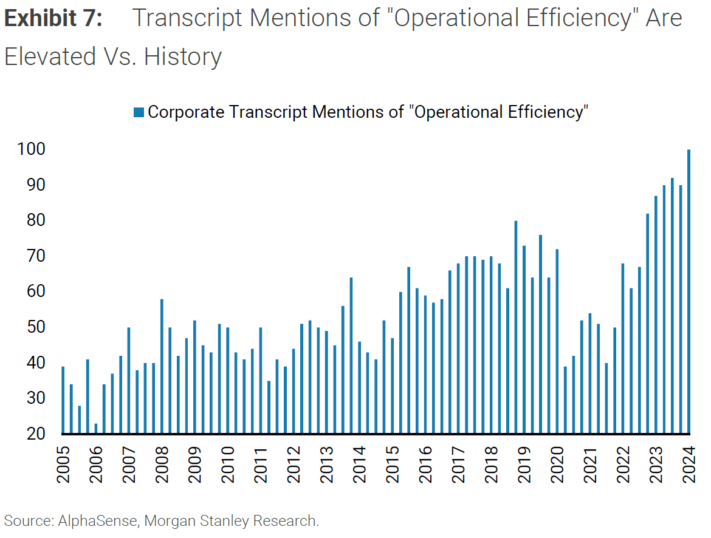
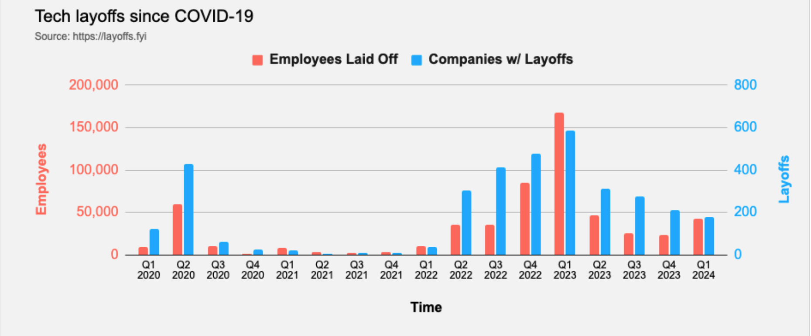

"The winner takes it all, the loser has to fall" - these are the lyrics of an award winning track by Swedish popgroup ABBA. The lyrics of the song, is currently manifesting in the equities space as we speak. The magnificent 7 (MAG7) and the likes are having their stock prices bid up while the remaining 400+ laggards of the S&P 500 are left for dead.

The continous rally of the MAG7 is justified - the strong demand for their AI productivity offerings and their efforts in reallocating capital to their core businesses, translates to increased earnings of their bottom-line. In the recent years, the demand for NVIDIA's GPU chips continues to accelerate beyond their traditional strongholds, to the automotive-industry, robotics, industrial digitization and enterprise GEN-AI solutions. This has further driven and will continue to drive the insatiable need for GPU-powered inference capabilities. 

The question to prompt the careful-minded investor is this : In the midst of insurmountable hype and momentum around the equities related to Aritificial Intelligence (of which the underlying mechanisms are simply a combination of mathematics and computation), would it be wise to continue to hop on the hype-train and ride it out to the promise-land ?

Or should the diligent-investor look for stocks that have been impaired in terms of their price, of which was futher amplified by the Federal Reserve's quickest tightening cycle in decades, but which fundamentals are sound and have a management team that are diligently executing their turnaround plan to get the impaired parts of the business fixed ? 

The point i'm trying to make is that you don't have to take on all battles for the sake of conflating your ego. You don't have to participate or have an opinion in every hot stock. If anything, you should be worried when sell-side talking heads, with little to no background in technology, are all talking about "AI" while trying to sell you the new AI ETF their firm has just launched. The beauty of investing in markets is that you could hand-pick your battles, such that each battle you take has greater odds of you winning, and in the unfortunate event of losing you could withstand the damage and fight for another day.

Hence, the ultimate investing framework, utilized by the investing giants that stood against the test of time, robust to volatility and tail-events, is simply allocating to 8-16 companies that have limited downside and unlimited upside. Whereby each allocation is sized in a way that in an the extremely unlikely event of one or two bankcruptcies, would not put you out on a stretcher. 

Cautionary Advised : 
The following is opinion and not advice. Your investment objective, risk-tolerance and timeframe might be different from mine so do consult your financial advisor.

Below I would make the case of the likely breakout of the S&P-500 and the likely broadening of the rally to include the other 400 equities that have been left-for-dead. Before I proceed to explain my stance, here's a little primer on U.S Interest Rates (Fed Funds Rate), and how it is an significant determinant of borrowing costs hence economic activit. Whether business owners are in the mode of expansion or consumers are in the mood of financing their next purchase of high-ticket items is strongly determined by it. 

The FEDs dual-mandate is simply keeping nflation at the ballpark of 2% all while maintaining maximum employment for americans. Throughout 2022-2023 the FED took on the most aggresive interest-rate hiking cycle to curb inflation rising from 0.25% to 5.25%. 

I would then make the case that going forward, the FED has all the tools to pilot a soft-landing given the strong workforce and economy, amplified by a significant boost in productivity driven by Gen-AI capabilities and better global collaboration infrastrucutre given the lockdowns of COVID.

Although the S&P-500 are currently at All-Time Highs, history tells us that it is tough to short new-highs, and the US markets have always broke out ATH resistance over a 3 year window. For the doubtful investor who focuses on the fundamentals and not statistics with a small sample-size. I would also list out the state of the US Economy.

## US Economy Outlook

Inflation measures such as the CPI (Consumer Price Index) and the Core PCE (Personal Consumption Expenditure) are approaching the FED's target rate.

Credit Card Deliquency Rates of 2023 are nowhere near that of the Great Financial Crisis or Pre-Great Financial Crisis era.

Capital on the sidelines are increasing to all time highs. This hints risk-averse than risk-on. Money market fund assets hit a new record high in February as savers and investors continue to pile in :

INSERT IMAGE

My favorite statistic comes from Tom Lee from FundStrat which suggests that in the past 18 elections since 1950 (post WWII), markets tends to perform well in election years, and perform even better there were >10% gains on the indices over the past year.

INSERT IMAGE

## It's not the action, but the expectation

## Recession or continued GDP growth ?

Throughout 2022 - 2024, Global CEOs had been **preparing for a recession that never came**. This is evident in the number of Corporate Transcript mentinos of the term "Operational Efficiency". This means companies are now leaner than ever while maintaining the same or even better output capacity.

[Layoffs.fyi](https://layoffs.fyi/) tracks layoffs of tech-companies around the world. Notice the clumping of layoffs in 2022 extending to early 2024. The firing bloodbath did not exclusively happen to tech companies but also to other industries partly due to the higher cost of borrowing and simply the instilled fear from sensational news. What isn't shown in this graph is the hiring surge that

With that said, layoffs only show half of the full picture. New jobs are being created is increasing as well shown by the steady unemployment rate remaining below 4%.

We had a technical recession - two subsequent quarters of negative GDP growth, which blew pass everyone's memory.

Productivity growth - the ability of an entity to produce more with the same capital investment inputs and labor - is the primary driver of GDP growth. The productivity growth enabled by the groundbreaking Gen-AI models (think ChatGPT, Gemini) are akin to the Information Technology revolution we had in the 1990s-2010s. The output we are ought to generate will remain and may even exceed despite the reduction in labor inputs.

New jobs were created

We will hence see margins expanding when the E in P/E (Earnings).
are growing, while their fixed-costs have been shrinking.
CEOs were preparing for a recession that never came, hence we will see margin expansion, when the E (earnings) are growing while their cost-basis has shrunked.

Rather, I would advise investors to conduct due diligence on those equities that have lagged behind beause of the Federal Reserve's most aggressive tightening cycle in modern times. Financial markets, ever oscillating between fear and greed, are prone to overexuberance on the upside and overpessimism on the downside. With the potential for monetary policy to turn accommodative as macroeconomic conditions evolve, the risk-reward ratio argues for some measured risk-taking in anticipation of a more constructive backdrop ahead.

Instead, I'm suggesting investors take a deeper look at the laggards - those the casualties of the Federal Reserve's most aggresive tightening cycle in modern times. The Stock Market, just like a pendulum, is ever oscillating between fear and greed. Asset prices tend to overshoot to the upside in exuberance and will overshoot to the downside in the face of uncertainty and pessimism. The ultimate framework is to focus on those names trading at pronounced discounts that maintain robust fundamentals or multiple catalysts that could unlock substantial value. This is especially prudent for rate-sensitive sectors and emerging markets.

The point I'm trying to make is to look for companies that have overshot to the downside and have plenty of catalysts laid out (or what poker players like to call - "many outs"). This is particularly true for companies that fall under the theme of - "Interest Rate Sensitive" and "Emerging Markets". With interest rates expected to fall in the future, investors may want to take on more risk in anticipation of an improving environment.

## Investing Framework

The framework and strategy deployed is - Top Down Bottom Up.

1. From the macro/general-market point of view, is 2024 the time to put on risk or lighten up and go risk-off ?

2. Drill down to sector to find those that would benefit from the macro tailwinds. It would be much better if the sector was previously unfavored to provide a margin of safety during the purchase.

3. Drill down to each individual company within those sectors that are likely to benefit, and perform the due diligence.

## Interest Rates outlook

## Interest Rate Sensitive US Stocks

## Emerging Markets

Looking back into 2023, peak pessimism happened when market participants were unsure of what the terminal interest rates would have to be, for the Federal Reserve to achieve its dual mandate - low and stable inflation (around 2%), with maximum employment.

The Russell 2000 index crashed between July 2023 and November 2023, but quickly bottomed once the Consumer Price Index (CPI) data turned out cooler-than-expected. A lower-interest rate environment will benefit the interest rate sensitive sectors e.g. Consumer Discretionary, Real-Estate, Dividend Stocks etc.

My philosophy is simple, focus on names with the most outs, while having a margin of safety.

The investment thesis is this : 
1) Buy companies that have been temporarily impaired due to mistakes (mismanagement of inventory, F.U.D news, cyclical downturns) and hence marked down and sold at peak pessimism, that will eventually recover.
