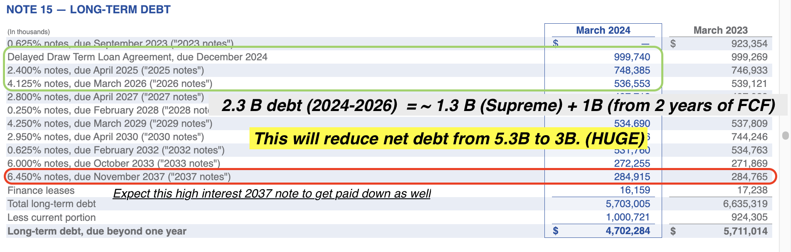

## Going Against the Most Crowded Trade
The image on the bottom left published by Goldman Sachs in February 2024 is the backbone of my investment thesis and the opportunity i'm trying to capture. I am taking the otherside of the most crowded trade. Part of it may be the programming inside me on how I live my life, for which I tend to avoid herd behaviour, but the main arguments are driven and grounded by fundamental shifts in earnings and market liquidity. Here are two main points on why I am taking this trade : 

1. Earnings of the MAG7 and ex-MAG7 are poised to normalize e.g. (MAG7 EPS YoY growth rate slows, and the ex-MAG7 catches up). MAG7 EPS growth throughout 2023 to mid 2024 was strong hence their outperformance. The opposite will also happen.

2. Impending Rate cuts by the FED **coming from a position of strength not weakness**. This opens up credit markets which would strongly benefit industrials, cyclicals like housing and construction, small-caps with floating rate debt, special situation distressed equities and many other left for dead sectors.

And that thesis is starting to play out, the bottom right shows the estimated MAG7 vs ex-MAG7 EPS growth going into 2025. You can see how EPS growth of MAG7 and ex-MAG7 is starting to converge, and valuations always follow earnings so expect prices to converge as well !
  

  

    
    
MAG7 driving most of the gains posted in February 2024

  

  

    
    
S&P 493 poised to catch up - posted in August 2024

  

<!-- 
As a user of LLMs like ChatGPT myself, the productivity boosts of LLMs are minimal e.g. creating a starting template (for a dispute letter, a HTML template, how to use this EXCEL function etc.).  And the occasional hallucination and spurious answers you get back from it makes the need for the user to spend as much time to fact-check, and debug.Couple that with fierce competition between the big-tech and tech-unicorns, they really wouldn't be generating the ROI necessary. 

This is analogous to how Meta in 2022 had to slow down spending on RealityLabs, their VR deparment focused on creating revolutionary headsets, which were at the time premature to be widely adopted in the next 3 years. The same will happen for all these GPU spend until the next technological brekathrough. Besides, the loneliness epidemic that followed from the Covid pandemic means us humans crave deeper human-to-human interactions, we crave a real-community. Many people are experiencing digital fatigue/burnout, and applications that assist on setting up such a real-community(Strava Run Clubs, Eventbrite) instead of replacing it (Virtual Reality) will truly benefit. -->

## Updates on My Top 4 Companies
---
1. ## VF Corporation

Since the **strong buy** I initiated in Feb 2024, **VFC** has achieved the following as of 15 September:

- **New management team with inflow of talented leadership**. Sun Choe (former Chief Product Officer of Lululemon) is now leading Vans, and the ex-CFO of Spotify, Paul Vogel, joining as the CFO. Sun Choe's achievements at Lululemon is undisputed and [here's an article on why Sun Choe](https://shop-eat-surf.com/2024/05/what-new-vans-president-sun-choe-can-bring-to-vans/) is a great fit for Vans.
  
- **Deleveraging of the balance sheet** through the $1.5 billion sale of Supreme (which really caught investors off-guard here). This, coupled with their guided operating cash flow, allows them to pay down their next three upcoming maturities, giving them a clear operating runway till 2027. That means **solvency concerns are now off the table.** Below lists the upcoming maturities for $VFC with the first one maturing in Dec 2024 and how they are able to pay down three thranches with the assumptions I listed.

This will follow with a **strategic and culture shift towards expansion of the business instead of conservation** all while maintaining a necessary level of financial discipline.

- **Vans' classic styles are experiencing a resurgence** since the last cycle in 2021. Fashion trends are fickle, and we can expect the Old Skool and Slip-ons to make a comeback after a three-year downcycle. I've attached a couple of links that highlights the resurgence [Vans are cool again by GQ](https://www.gq.com/story/vans-are-cool-again), [Chequered Vans is the new Sambas by Vogue](https://www.vogue.co.uk/article/gigi-hadid-adidas-sambas-chequerboard-vans-trend),  [Trainers that will give sambas serious competition](https://metro.co.uk/2024/08/22/nostalgic-trainers-give-adidas-sambas-serious-competition-21302021/).

- **KNU Skool is addressing the younger audience's shift toward chunkier shoes**. Vans, between 2022 and late 2023, didn't have an answer to this trend, the trend of younger consumers gravitating toward baggier jeans paired with bold chunkier shoes (like New Balance 530s and Crocs). The **KNU Skool** is changing that. Foot Locker's recent earnings call noted:  
  > "We're seeing encouraging trends out of the Vans brand, especially through their KNU Skool franchise. Next to that, we are excited for a strong boot season with Timberland this fall and holiday." – Foot Locker

- **Foot Locker reiterated a strong boot season for Timberland.** They've announced the "Iconic" campaign in September featuring Naomi Capmbell and others. Additionally, Timberland is trending strongly in Korean K-Pop, which has significant influence in East Asian fashion and will likely impact the largest consumer market in the world, China.

- **CEO has bought $2 million worth of shares**: 1 million at $15.38, and another million at $13.20. The second purchase happened within the same quarter that the Supreme sale was disclosed.

- **Mid-Small caps offer a better relative valuation than the Nasdaq Tech index**. As of August 30, $VFC is ranked number 14 in terms of portfolio weightage of the [iShares Small Cap 600 UCITS ETF]((https://www.ishares.com/uk/individual/en/products/251920/ishares-sp-smallcap-600-ucits-etf)). [The exclusion of $VFC from the S&P 500](https://finance.yahoo.com/news/p-500-add-3m-ge-223831526.html) in March 2024, and its subsequent inclusion in the S&P 600, sparked a sell-off in the stock. However, the diligent investor will see this as a tailwind, as markets start to turn risk-on into year-end, knowing the rate hiking cycle has ended.

- **Weak year-over-year comps for Q2 and Q3 2025**: Vans sales were horrid for FY24 last year. They were particularly bad in Q3-Q4. With that said, this bad news will become a tailwind as it becomes low comps a year out. All the analysts will then all get excited when they see strong double digit headline growth again.

All of these improvements while VF Corp is trading at lows of $17.00. They will eventually achieve their financial targets to bring Net Debt /EBITDA back to 2.5x levels. For context, Net Debt as of Aug 2024 is 5.3B and post Supreme sale, this Net Debt will be shrunk close to 3.6 billion.

In 2019, **VFC** achieved $2.3 billion of EBITDA, driven by strong growth in Vans. And that was before The North Face had strong double digit revenue growth years throughout 2019-2024. It really only requires an EBITDA of roughly $1.4 billion (60% of 2019 EBITDA highs) to achieve the target of reducing its **Net Debt / EBITDA** ratio to 2.5x Now that **The North Face** is generating as much revenue as Vans in 2024, this target is definitely achievable simply by **operating more efficiently**, focusing on **brand building** and capitalizing on fashion-trend shifts.

What will truly prop up excitement for this stock and bring it up to >$50 a share are the **untapped opportunities** no one is even thinking about. Vans Apparel makes up ~20% of Vans sales, and surprise surprise, **Sun Choe** has strong experience in apparel. If Vans could come up with a streetwear product line that competes with Stussy/Thrasher, that's another opportunity that will drive double digit growth. **Brand relevance** of Vans and Timberlands is also low in APAC so many opportunities there, a success story is **TNF experiencing 35% YOY growth in APAC region**. [Read more on this here.](https://www.chinadaily.com.cn/a/202405/28/WS66553489a31082fc043c97bb.html)

VF Corp is like a beloved, classic car - admired for its elegance, long history, beautiful exterior (it's BRANDS) and it's power (Operational Effienciy. )After years of wear-and-tear, it starts to lose some of its power. Now it's gone through a complete overhaul. All the old, worn-out parts have been replaced with a much strong engine (NEW CEO, NEW MANAGEMENT TEAM), streamlined for greater efficiency (ReINVENT program). While the exterior still hold its nostalgic charm and elegance (THE BRANDS), beneath the hood, everything is new and optimized for the road ahead, ready to **OUTPERFORM** its past-self.

---

2. ##  PayPal 

  
Expand to read about PayPal

  

    **Investment Thesis:** Increasing adoption of digital payments.
    
    <!-- Add more content as needed -->
  

---

3. ## Alibaba  
- **Brief Description:** Chinese e-commerce giant.  
- **Investment Thesis:** Dominant market position in China and international expansion. Todo

---

4. ## Cooper Standard 
- **Brief Description:** Automotive supplier.  
- **Investment Thesis:** Strong market share, technological advancements, and exposure to the growing automotive industry. Todo
