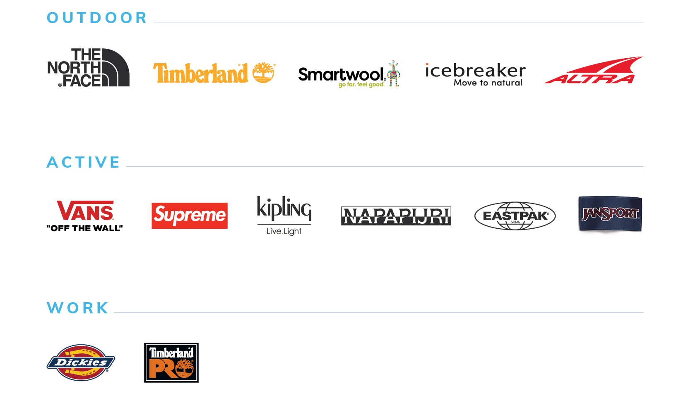
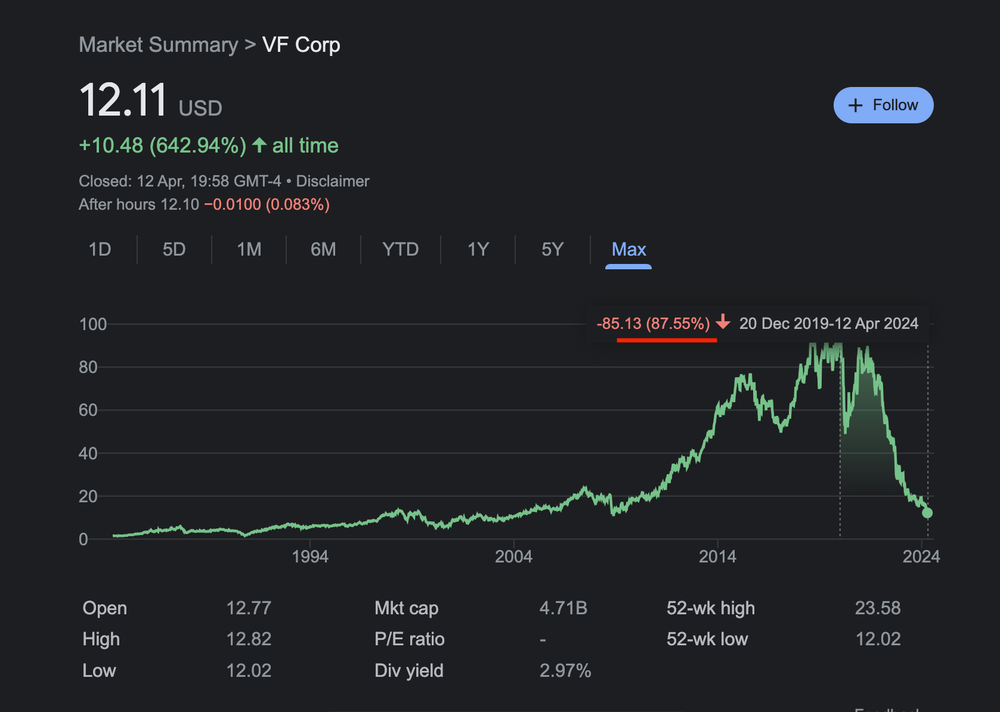

### The Turnaround Story

VF Corp is one of the world's largest footwear, apparel, and accessories companies. It owns a portfolio of highly iconic brands, including The North Face, Vans, Timberland and Supreme.

### The Fall from Grace
The stock has crashed 88% from its all-time high of $100 per share and is currently trading at $12 per share. What has changed,you may ask ? The sell-off can be attributed to all of these factors :

1. Early 2019, VF Corp sold of their denim brands (Wrangler and Lee Jeans to now known as Kontoor Brands), which have since shown resilient growth on the top and bottom line.
2. Dec 2020, they did a $2.1 billion debt-financed acquisition of Supreme, which has since resulted in approximately 800 million in impairment cost, and the company has yet to succeed in monetizing the Supreme brand.
3. Over-ordering of inventories during COVID-19, resulting in the need to sell inventory at a discount.
4. Vans' sales deteriorating 15% year-over-year in 2022 and a further 22% year-over-year in 2023, resulting in an accumulated decline of 34% from peak Vans sales.
5. March 17 2022, FED begins rate hikes to curb inflation. It increased from 0.25% in March 2022 to 5.25% in July 2023. This affects the cost of financing for VFC given their debt pile.
6. In Dec 2022, Steve Rendle as the CEO at the time made a sudden exit from the company during a time of deteriorating sales. Company lost its direction and an interim CEO had to be put in place
7. In July 2023, a new CEO, Bracken Darrell (former Logitech CEO), was put in place to revitalize the brands, but he subsequently cut revenue and earnings guidance, cut the dividend yield from ~5% to 0.9%, and declared multiple asset write-downs. This further crashed the stock price, while the company announced the "Reinvent" program, a 4 year plan to bolster growth.
8. As of October 2023, VFC had become a debt-ridden company with upcoming debt maturities to refinance, making it highly susceptible to interest rate fluctuations. The US 10-Year Yield at that time hit a 52-week high of 5% in October 2023, and the stock slid to $13.
9. In April 2024, VFC was dropped from all S&P 500-related indices and the FTSE All-World Index due to its market cap falling into the small-cap category, further contributing to the slide in the share price.
10. On April 11, 2024, the Consumer Price Index (a measure of inflation) was higher than expected, pushing back the need for the FED to cut interest rates, and VFC's stock slid to a 15-year low of $12 per share, last seen during the 2018 Financial Crisis.

## The Turnaround Opportunity

Despite the deteriorating sales, I believe the bottom is near, and the company has all the necessary components for a turnaround. Here's why:

### New CEO: Bracken Darrell

Bracken Darrell has an amazing track record in leading consumer product companies and elevating the consumer experience. He previously served as the CEO of Logitech for 10 years, during which time the share price increased tenfold. At Logitech, he strategically positioned the company into different markets, such as gaming (LogitechG) and video collaboration/live streaming tools, and oversaw the design of the most successful MX series. The tiny gaming business of Logitech, which started off at $40 Million grew to $1 Billion by the time he left. Logitech-MX series was founded during his tenure,

Before Logitech, Darrell was at Procter & Gamble, tasked with rejuvenating the sales of Old Spice's (male grooming products) to appeal to a younger demographic, which he successfully did. Darrell has a strong track record with companies that have lost its footing and needs new product lines to rejuvenate growth. This time is no different.

### VF Corp's 5-Point Turnaround Plan: "Reinvent"
VF Corp under Bracken Darrell announced a transformation plan called "Reinvent" which addresses shareholders top priorities and will focus on brand building and revitalizaiton. Here are the core issues to be addressed : 

1. **Deliver a Vans Brand Turnaround**: Reset the brand's purpose, target audience, product plan, and marketing approach, and introduce new products and reset the marketplace in Q3 and Q4 of 2024.
2. **Fix the Underperformance in the Americas Region**: Establish a new commercial organization and regional platform, similar to the strategy used in the EMEA region, to improve results over time.
3. **Reduce Debt and Strengthen the Balance Sheet**: This is a top priority. VFC at one point racked up 6.5 billion in debt. In the most recent quarter, VF benefited from inventory reduction and a slashed dividend. They are already reducing net debt substantially and plan to monetize non-core physical assets to pay down upcoming debt without refinancing.
4. **Lower the Cost Base**: Deliver $300 million in fixed cost savings through simplifying and right-sizing the company's structure, selling real estate assets in Switzerland, and addressing other non-strategic areas.
5. **Strategic Review of the Brand Portfolio**: Sell off non-core brands, such as Kipling, Eastpak, and Jansport, that do not align with their long-term ambitions, to raise cash and pay down debt. VF Corp has 13 brands, and there may be other brands which will be sold.

### Recent Developments

- Activist investors, such as Engaged Capital and Legion Partners Asset Management, own a significant stake in VF Corp, indicating their confidence in the turnaround potential.
- VF Corp reaffirmed its free cash flow guidance of $600 million, which is HUGE NEWS for a company in the midst of a turnaround. You need the Free Cash Flow to make due your payments.
- VF Corp recently collaborated with Dubai's GMG to open 200 more stores across Southeast Asia, North Africa, the United Arab Emirates, and the Kingdom of Saudi Arabia in the next 5 years, does this look like a company with deteriorating sales or a company ready to enter growth mode ? 
- In their most recent quarter, the company has worked down inventories and significantly improved their cash conversion cycle, achieving positive changes in accounts receivable.

## Valuation Analysis
The North Face (TNF) brand, which is one of VFC's brands, alone generates $3.6 billion in revenue annually and is still continuing to grow. 

In comparison, Crocs, a footwear company with only two brands, generates $3.9 billion in revenue and has a market capitalization of $7.5 billion. 

VF Corp, with 13 brands, of which TNF alone generates $3.6 billion in revenue, is trading at a market capitalization of only $4.7 billion. How is this $2.8 billion difference justified ?  

Here's a DCF Model assuming 0% growth of VFC's net income in perpetuity. 

<iframe src="https://docs.google.com/spreadsheets/d/e/2PACX-1vSfVraRxX7JS6bAB9daSzm4wdFd0kwVMSWZ5khtvuSEzCwtiaIdfNOBcgPdFvSCYjGKoHVl6L72wT6J/pubhtml?widget=true&amp;headers=false" width="200%" height="800"></iframe>
