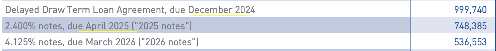

## The Turnaround Story

VF Corp is one of the world's largest footwear, apparel, and accessories companies. It owns a portfolio of highly iconic brands, including The North Face, Vans, Timberland, Dickies and Supreme.

## The Fall from Grace
The stock has crashed 88% from its all-time high of $100 per share and is currently trading at $12 per share at time of writing. Here are detailed timeline on what attributed to the sell-off

1. Early 2019, VF Corp mistakenly sold off a growth brand - the denim brands (Wrangler and Lee Jeans, now known as Kontoor Brands), which have since shown resilient growth on the top and bottom line.
2. Dec 2020, then CEO Steven Rendle did a $2.1 billion debt-financed acquisition of Supreme to fuel growth. This has since resulted in approximately 800 million in impairment cost, and less growth than forecasted. Rendle also reduced brand level autonomy by shifting the HQ to Denver, turning VF Corp into this bureaucratic corporation where each brand begun losing its autonomy overtime.
3. Over-stocking of inventories during COVID-19, resulting in the need to sell their apparel/footwear inventory at a discount.
4. Vans' sales deteriorated 15% year-over-year in 2022 and a further 22% year-over-year in 2023, resulting in an accumulated decline of 34% from peak Vans sales in 2020, this persistent decline raised concerns of the brand strength.
5. March 17 2022, FED begins rate hikes to curb inflation. It increased from 0.25% in March 2022 to 5.25% in July 2023. This has affected the cost of financing for VFC given their huge debt pile.
6. In Dec 2022, Steve Rendle as the CEO at the time made a sudden exit from the company during a time of deteriorating sales. Company lost its direction and an interim CEO had to be put in place
7. In July 2023, a new CEO, Bracken Darrell (former Logitech CEO), was put in place to revitalize the brands. The first thing he did was to book a kicthen sink quarter, subsequently cutting revenue and earnings guidance, cut the dividend yield from ~5% to 0.9%, and declared multiple asset write-downs. This depressed earnings and further crashed the stock price, meanwhile, the company announced the "Reinvent" program under Bracken, a 4 year plan to bolster growth of $VFC.
8. As of October 2023, VFC had become a debt-ridden company with three upcoming debt maturities to refinance, making it highly susceptible to interest rate fluctuations. The US 10-Year Yield at that time hit a 52-week high of 5% in October 2023, and the stock slid to $13.
9. In February 2024, S&P downgrades the stok from BBB to BBB- as the Dec 2024 and April 2025 maturities are inching closer, totalling to 1.75B USD, of which they would have to either pay down via brand sales or face refinance the debt at >6% rates given deteriorating credit quality.

10. In April 2024, VFC was dropped from all S&P 500-related indices and the FTSE All-World Index due to its market cap falling into the small-cap category, further contributing to the slide in the share price. 
11. On April 11, 2024, the Consumer Price Index (a measure of inflation) was higher than expected, pushing back the need for the FED to cut interest rates, and VFC's stock slid to a 15-year low of $12 per share, last seen during the 2018 Financial Crisis.

In short, you can attribute the derating of the stock to four main reasons :  *Deteriorating Brand Heat*, *Concerns on Debt Obligations*, *Dividend Cuts*, and a *Managerial Mess*. I truly love this opportunity because the value-destruction of VF Corp was mostly self-inflicted by management while the consumer's affinity towards the brand remains strong. 

## The Turnaround Opportunity
Having laid the backstory on how we got here, I would now lay out why they have more than enough to pull this turnaround. 

### 1) Strong brand equity
Vans remains the number one skatingboard across the globe and one of the only brands that champions authenticity and being Off-The-Wall (non-conformity). This motto resonates strongly with many subcultures including skateboarders, creatives, punk-culture which gives them this unique favoritism over othe brands. Yet it is also broad enough for everyone to embrace.

> *The most Off-The-Wall thing you can do is to be yourself.* 
> *– Vans*

The North Face - Number one European brand.

### 2) Betting on the Jockey : CEO Bracken Darrell
Bracken Darrell is the ex-CEO of Logitech, and has an amazing track record in leading consumer product companies and elevating the consumer experience. He served for 10 years, during which time the share price increased tenfold. At Logitech, he strategically positioned the company into different markets, such as gaming (LogitechG) and video collaboration/live streaming tools, and oversaw the design of Logitech's most successful product-line, the MX series. The tiny gaming business of Logitech, which started off at $40 Million grew to $1 Billion by the time he left. What's most impressive is he positioned Logitech to be a premium brand, and improved EBITDA margins from 4.5% to 14.6%.

Before Logitech, Darrell was at Procter & Gamble, tasked with rejuvenating the sales of Old Spice's (male grooming products) to appeal to a younger demographic, which he successfully did. Darrell has a strong track record with companies that have lost its footing and needs new product lines to rejuvenate growth. This time is no different.

He opened his first earnings call with $VFC with this : 

> *As a new CEO, I want to hit our numbers (forecasts). At the end of the day, the first numbers I’m going to give you, we will hit.”*
> *– Bracken Darrell -*“

### 3) VF Corp's 5-Point Turnaround Plan: "Reinvent"
VF Corp under Bracken Darrell announced a transformation plan called "Reinvent" which addresses shareholders top priorities and will focus on brand building and revitalizaiton. Here are the core issues to be addressed : 

1. **Deliver a Vans Brand Turnaround**: Reset the brand's purpose, target audience, product plan, and marketing approach, and introduce new products while simulatenously resetting the marketplace in Q3 and Q4 of 2024.
2. **Fix the Underperformance in the Americas Region**: Establish a new commercial organization and regional platform, similar to the strategy used in the EMEA region, to improve results over time.
3. **Reduce Debt and Strengthen the Balance Sheet**: This is a top priority. VFC at one point racked up 6.5 billion in debt. In the most recent quarter, VF benefited from the cash generated from inventory reduction and a slashed dividend. They are already reducing net debt substantially and plan to monetize non-core physical assets to pay down upcoming debt without refinancing.
4. **Lower the Cost Base**: Deliver $300 million in fixed cost savings through simplifying and right-sizing the company's structure (layoffs), selling real estate assets in Switzerland, and addressing other non-strategic areas.
5. **Strategic Review of the Brand Portfolio**: Sell off non-core brands, such as the backpacks business (Kipling, Eastpak and Jansport) and many others, that they think do not align with their long-term ambitions, to raise cash and pay down debt. VF Corp has 13 brands, and there may be other brands which will be sold.

### 4) The Assembly of the Dream Team 
VF Corp has taken a comprehensive restructuring of the business which includes a drastic organisational change. Paul Vogel joins from Spotify as the CFO of VF Corp. Sun Choe has been appointed Brand President of Vans. She was the Chief Product Officer of one of the fastest growing athleisure brand - Lululemon. Caroline Brown was appointed to lead TNF, and she was the former CEO of DKNY etc. 

### 5) Positive Developments

- Activist investors, such as Engaged Capital and Legion Partners Asset Management, own a significant stake in VF Corp, indicating their confidence in the turnaround potential.
- VF Corp reaffirmed its free cash flow guidance of $600 million, which is HUGE NEWS for a company in the midst of a turnaround. You need the Free Cash Flow to make due your payments.
- In their most recent quarter, the company has worked down inventories and significantly improved their cash conversion cycle, achieving positive changes in accounts receivable.
- Vans 18-month marketing plan is underway and the KNU Skool is trending strongly amongst the youth and has became their second best-selling franchise.
- VF Corp recently collaborated with Dubai's GMG to open 200 more stores across Southeast Asia, North Africa, the United Arab Emirates, and the Kingdom of Saudi Arabia in the next 5 years (growth story)

## Valuation Analysis

### Comparative
The North Face (TNF) brand, which is one of VFC's brands, alone generates $3.6 billion in revenue annually and is still continuing to grow. 

In comparison, Crocs, a footwear company with only two brands, generates $3.9 billion in revenue and has a market capitalization of $7.5 billion. 

VF Corp, with 13 brands, of which TNF alone generates $3.6 billion in revenue, is trading at a market capitalization of only $5 billion at the time of writing. How is this $2.4 billion difference justified ?  

## 

<iframe src="https://docs.google.com/spreadsheets/d/e/2PACX-1vSfVraRxX7JS6bAB9daSzm4wdFd0kwVMSWZ5khtvuSEzCwtiaIdfNOBcgPdFvSCYjGKoHVl6L72wT6J/pubhtml?widget=true&amp;headers=false" width="100%" height="800"></iframe>

### Incremental good news 

https://www.vogue.com/article/gigi-hadid-checkerboard-vans
